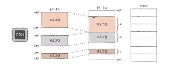

# Chapter6 메모리와 캐시 메모리

## 6-1) RAM의 특징과 종류

RAM에 대해 자세히 알아보고, DRAM, SRAM, SDRAM, DDR SDRAM에 대해 알아본다.

### RAM의 특징

RAM에는 실행할 프로그램의 명령어와 데이터가 저장된다.

전원을 끄면 RAM에 저장된 명령어와 데이터는 모두 날아간다. 전원을 끄면 저장된 내용이 사라지는 저장 장치를 **휘발성 저장 장치**라고 한다.

반면, 전원이 꺼져도 저장된 내용이 유지되는 저장 장치는 **비휘발성 저장 장치**라고 한다. ex) SSD, CD-ROM

보조기억장치인 비휘발성 저장 장치에는 '보관할 대상'을 저장하고, 휘발성 저장 장치인 RAM에는 '실행할 대상'을 저장한다.

### RAM의 용량과 성능

RAM의 용량이 크다면, 보조기억장치에서 많은 데이터를 가져와 미리 RAM에 저장할 수 있다. 그렇다고, RAM 용량이 클수록 무조건 프로그램 실행 속도가 빨라지는건 아니다. 용량이 필요 이상으로 커졌을 땐, 속도가 그에 비례해서 증가하지 않는다.

### RAM의 종류

RAM의 종류에는 크게 DRAM, SRAM, SDRAM, DDR SDRAM이 있다.

- **DRAM**

  - DRAM은 Dynamic RAM의 준말이다.
  - 저장된 데이터가 동적으로 변하는 RAM이다.
  - 시간이 지나면 저장된 데이터가 점차 사라진다.
  - 데이터의 소멸을 막기 위해 일정 주기로 데이터를 재활성화 한다.
  - 일반적으로 자주 사용하는 RAM이다.
  - 소비 전력이 비교적 낮고, 저렴하고, 집적도가 높아 대용량으로 설계하기 용이하다.

- **SRAM**

  - SRAM은 Static RAM의 준말이다.
  - 저장된 데이터가 변하지 않는 RAM을 의미한다.
  - DRAM보다 빠르다.
  - 소비전력이 높고, 가격이 비싸며, 집적도가 낮다.
  - 대용량으로 만들어질 필요는 없지만 속도가 빨라야하는 저장장치에 사용된다.
  - 캐시메모리에 사용된다.

- **SDRAM**

  - SDRAM은 Synchronous Dynamic RAM의 준말이다.
  - 클럭 신호와 동기화 된, 발전된 형태의 DRAM이다.
  - 클럭신호와 동기화되었다는건 클럭 타이밍에 맞춰 CPU와 정보를 주고받을 수 있다는 걸 의미한다.

- **DDR SDRAM**
  - DDR SDRAM은 Double Data Rate SDRAM의 준말이다.
  - 최근 가장 흔히 사용되는 RAM이다.
  - 대역폭을 넓혀 속도를 빠르게 만든 SDRAM이다.
  - 2^N 으로 대역폭이 증가한다.

## 6-2) 메모리의 주소 공간

메모리의 주소 공간인 **물리 주소**와 **논리 주소**에 대해 알아본다.

### 물리 조소와 논리 주소

```mermaid
graph LR;
	A[주소] --> B[물리 주소]
	A --> C[논리 주소]
```

메모리가 사용하는 **물리 주소**는 말 그대로 정보가 실제로 저장된 하드웨어상의 주소를 의미한다.

CPU와 실행 중인 프로그램이 사용하는 **논리 주소**는 실행 중인 프로그램 각각에게 부여된 0번지부터 시작되는 주소를 의미한다.

정리하자면, 메모리가 사용하는 주소는 하드웨어상의 실제 주소인 물리 주소이고, CPU와 실행 중인 프로그램이 사용하는 주소는 각각의 프로램에 부여된 논리 주소입니다.

논리 주소와 물리 주소 간의 변환은 CPU와 주소 버스 사이에 위치한 **메모리 관리 장치(MMU)** 라는 하드웨어에 의해 수행된다.



MMU는 CPU가 발생시킨 논리 주소에 베이스 레지스터 값을 더하여 논리 주소를 물리 주소로 변환한다. 예를 들어 현재 베이스 레지스터에 15000이 저장되어 있고 CPU가 발생시킨 논리 주소가 100번지라면 이 논리 주소는 아래 그림처럼 물리 주소 15100번지(100+15000)로 변환된다.

### 메모리 보호 기법

다른 프로그램의 영역을 침범할 수 있는 명령어는 위험하기 때문에, 논리 주소 범위를 벗어나는 명령어 실행을 방지하고 실행 중인 프로그램이 다른 프로그램에 영향을 받지 않도록 보호할 방법이 필요하다. 이는 **한계 레지스터**라는 레지스터가 담당한다.

베이스 레지스터가 실행중인 프로그램의 가장 작은 물리 주소를 저장한다면, 한계 레지스터는 논리 주소의 최대 크기를 저장한다. 즉 프로그램의 물리 주소 범위는 베이스 레지스터 값 이상, 베이스 레지스터값 + 한계 레지스터 값 미만이 된다.

## 6-3) 캐시 메모리

CPU가 메모리에 접근하는 시간은 CPU의 연산 속도보다 느리다. CPU가 연산을 빠르게 한다해도 메모리에 접근하는 시간이 느리면 CPU의 빠른 연산 속도는 아무런 쓸모가 없어진다. 이를 극복하기 위한 저장 장치가 **캐시 메모리**이다.

### 저장 장치 계층 구조

컴퓨터가 사용하는 저장 장치들은 'CPU에 얼마나 가까운가'를 기준으로 계층적으로 나타낼 수 있다. 이를 **저장 장치 계층 구조**라고 한다.

CPU에 가까운 저장 장치일수록 빠르고, 용량이 작고 비싸다.

### 캐시 메모리

CPU가 메모리에 접근하는 속도는 레지스터에 접근하는 속도보다 느리다. 그럼에도 불구하고 CPU는 프로그램을 실행하는 과정에서 메모리에 빈번히 접근해야만 한다. CPU 연산속도가 아무리 빨라도 메모리에 접근하는 속도가 그에 따라가지 못한다면 CPU의 발전은 아무 소용 없다.

그래서 등장한 저장 장치가 캐시 메모리이다. **캐시 메모리**는 CPU와 메모리 사이에 위치하고, 레지스터보다 용량이 크고 메모리 보다 빠른 SRAM기반의 저장 장치이다.


컴퓨터 내부에는 여러 개의 캐시 메모리가 있다. 이 캐시 메모리들은 CPU와 가까운 순서대로 계층을 구성한다. 코어와 가장 가까운 캐시 메모리를 L1 캐시, 그다음 가까운 캐시 메모리를 L2 캐시, 그다음 가까운 캐시 메모리를 L3 캐시라고 한다.

### 참조 지역성 원리

캐시 메모리는 메모리에 있는 모든 내용을 가져다 저장할 수는 없다. 메모리가 보조기억장치의 일부를 복사하여 저장하는 것처럼 캐시 메모리는 메모리의 일부를 복사하여 저장한다.

캐시 메모리는 CPU가 사용할 법한 대상을 예측하여 저장한다. 이때 자주 사용될 것으로 예측한 데이터가 실제로 들어맞아 캐시 메모리내 데이터가 CPU에서 활용될 경우를 **캐시 히트**라고 한다. 반면, 예측이 틀려 메모리에서 필요한 데이터를 직접 가져와야 하는 경우를 **캐시 미스**라고 한다.

캐시가 히트되는 비율을 **캐시 적중률**이라고 한다.

```
캐시 적중률 = (캐시 히트 횟수) / (캐시 히트 횟수 + 캐시 미스 횟수)
```

캐시 적중률이 높을수록 CPU가 빠르게 동작할 수 있다. 캐시 메모리는 한가지 원칙에 따라 메모리로부터 가져올 데이터를 결정하는데 이를 **참조 지역성의 원리**라고 한다. 참조 지역성의 원리는 CPU가 메모리에 접근할 때의 주된경향을 바탕으로 만들어진다.

1. CPU는 최근에 접근했던 메모리 공간에 다시 접근하려는 경향이 있다.

변수에 값을 저장하고 나면 언제든 변수에 다시 접근하여 변수에 저장된 값을 사용할 수 있다. 이렇게 '최근에 접근했던 메모리 공간에 다시 접근하려는 경향'을 **시간 지역성**이라고 한다.

2. CPU는 접근한 메모리 공간 근처를 접근하려는 경향이 있다.

하나, 혹은 여러 프로그램에 관련 데이터들은 한데 모여있다. 이렇게 '접근한 메모리 공간 근처를 접근하려는 경향'을 **공간 지역성**이라고 한다.